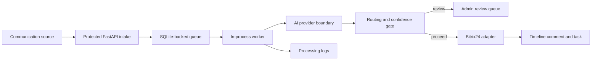

# Architecture

Demo/product prototype. Not a commercial deployment.

Layers:
- API: public intake, lookup, admin pages.
- Core: schemas, state machine, masking, security.
- Services: AI, routing, task building, Bitrix sync, worker orchestration.
- Persistence: SQLite models and processing logs.

State machine:
- `received -> processing -> summarized -> bitrix_syncing -> completed`
- `received -> processing -> summarized -> review_needed -> approved -> bitrix_syncing -> completed`
- `received -> duplicate`
- `received -> dropped`
- `processing -> failed_retryable`
- `failed_retryable -> processing`
- `failed_retryable -> failed`
- `review_needed -> dropped`
- `failed -> dropped`

Mock and real modes:
- Mock AI provider is deterministic and testable.
- Deterministic fallback protects the pipeline if AI fails.
- Mock Bitrix adapter records planned actions with dry-run behavior.
- Real Bitrix adapter is isolated behind an explicit write guard.

Production upgrade path:
- PostgreSQL + migrations
- external queue/worker
- stronger auth/audit
- richer Bitrix entity mapping
- stricter observability and retries
